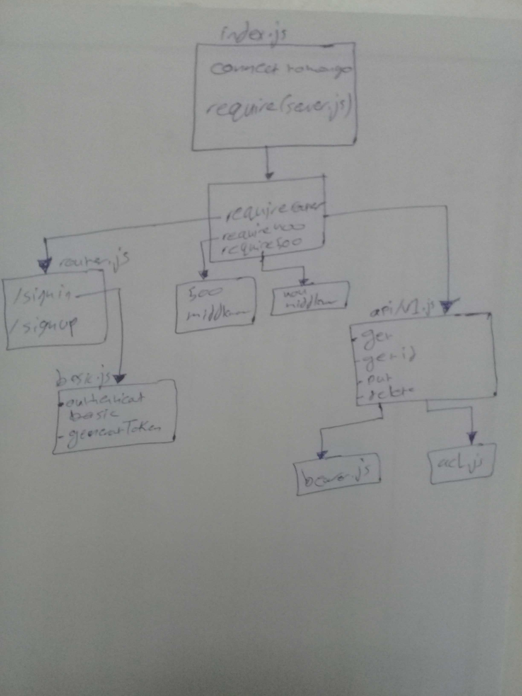

# authenticated-api-server

## Author : Hammad Ali

## Resourcs 
* Heroku : https://authenticated.herokuapp.com/

## Setup

* PORT = 4000

**To run the app you should do this steps :**

* sign up : http://localhost:3000/signup
* sign in : http://localhost:3000/signin

* post + get : http://localhost:3000/api/v1/categories
* post + get : http://localhost:3000/api/v1/products
* delete + put :http://localhost:3000/api/v1/categories/id
* delete + put :http://localhost:3000/api/v1/products/id

## UML

